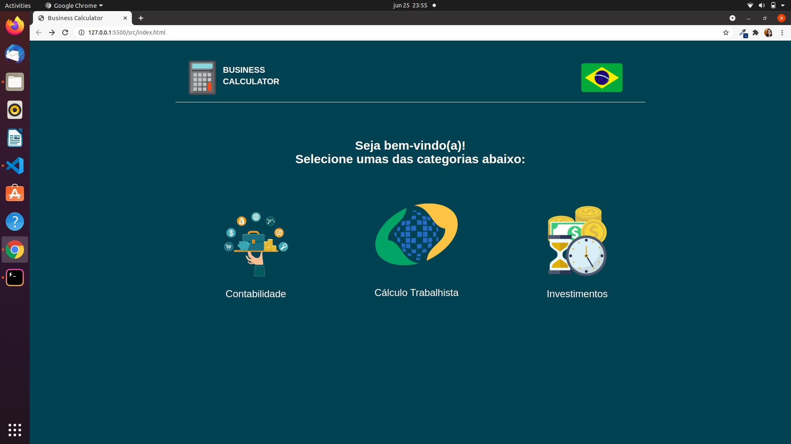
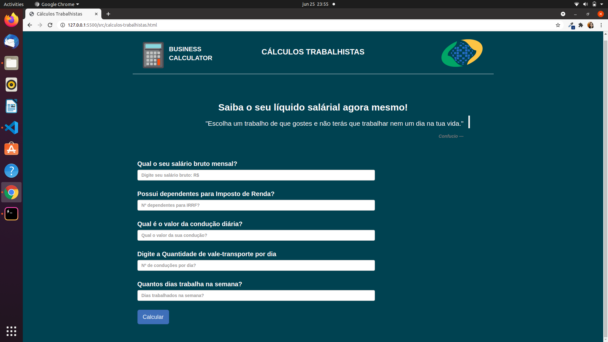
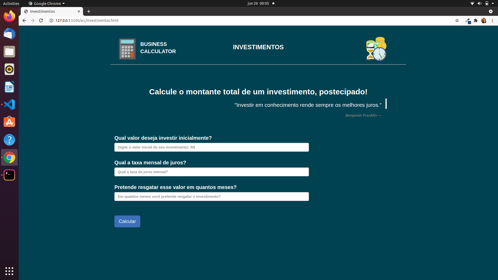
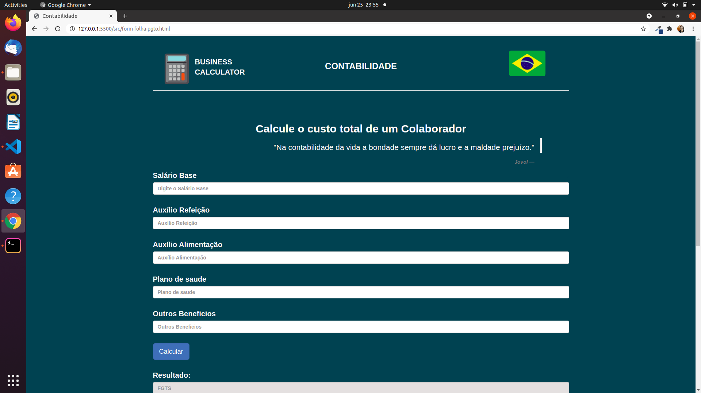

# Projeto de Interface

Visão geral da interação do usuário pelas telas do sistema e protótipo interativo das telas com as funcionalidades que fazem parte do sistema (wireframes).

Abaixo as principais interfaces do plataforma. Onde através das telas, tentamos oferecer a melhor visualização para o cliente, e maior entendimento das funcionalidades que disponibilizamos.

 
Figura 1 - Tela Prototipo

## Tela Principal

Através dessa tela, o usuário poderá iniciar o cálculo desejado e as funcionalidades que é oferecido.

## Wireframes

São protótipos usados em design de interface para sugerir a estrutura de um site web e seu relacionamentos entre suas páginas. Um wireframe web é uma ilustração semelhante do layout de elementos fundamentais na interface.Abaixo modelos que iremos utilizar, para a realização do projeto.

 
Figura 2 - Tela Prototipo

 
Figura 3 - Tela Prototipo

 
Figura 4 - Tela Prototipo

A imagem a seguir ilustra o fluxo do usuário em nossa solução. Assim que o usuário entra na plataforma, ele é apresentado à tela inicial (Tela 1) onde ele é confrontado com as opções selecione categoria.

Nessa tela (Tela1), o usuário também pode escolher para selecionar o cálculo que deseja e nas figuras 3 e 4 também pode ser visto outros modelos de cálculos.
