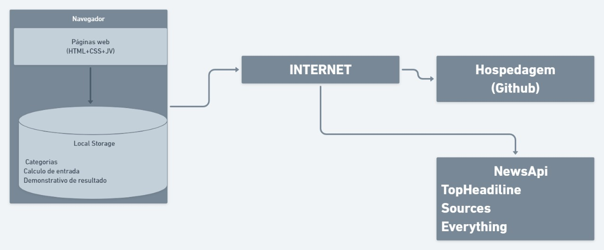
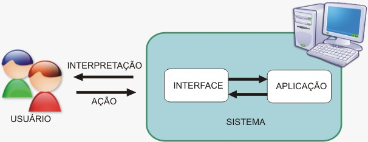

# Arquitetura da Solução

Definição de como o software é estruturado em termos dos componentes que fazem parte da solução e do ambiente de hospedagem da aplicação.

## Diagrama de componentes

Diagrama que permite a modelagem física de um sistema, através da visão dos seus componentes e relacionamentos entre os mesmos.

Exemplo:

Os componentes que fazem parte da solução são apresentados na Figura Arquitetura da Solução.

Figura 5 - Arquitetura da Solução

A solução implementada conta com os seguintes módulos:
- **Navegador** - Interface básica do sistema;
- **Páginas Web** - Conjunto de arquivos HTML, CSS, Java Script e imagens que implementam as funcionalidades do sistema.
- **Local Storage** - Armazenamento mantido no Navegador, onde são implementados bancos de dados baseados em JSON. São eles:
  
  -**Categorias** – Escolha de cálculo para registro.
    
  -**Cálculo de entrada** - Registro de cálculos para a solução.
    
  -**Demonstrativo de resultado** - Solução referente ao cálculo escolhido.
    
  • Hospedagem - Local na Internet onde as páginas são mantidas e acessadas pelo navegador.

## Tecnologias Utilizadas

As tecnologias utilizadas, para resolver o problema, ou seja implementar a solução, são descritas abaixo.

Implementação de solução:

    • Linguagens: Páginas web; html css Java script;
    • Frameworks: Board;
    • Serviços web: HTPP;
    • IDEs de desenvolvimento: Visual Studio Code;
    • Ferramentas: Mapeamento do processo, organização de informações, busca de soluções, análise de dados.

Figura 6 - Implementação de solução

## Hospedagem

O site utiliza a plataforma do Github como ambiente de hospedagem do site do projeto. O site é mantido no ambiente da URL: 
https://github.com

A publicação do site no Github é feita por meio de uma submissão do projeto (push) via git para o repositório remoto que se encontra no endereço: 
https://github.com/ICEI-PUC-Minas-PMV-ADS/pmv-ads-2021-1-e1-proj-web-t1-business-calculator
.
